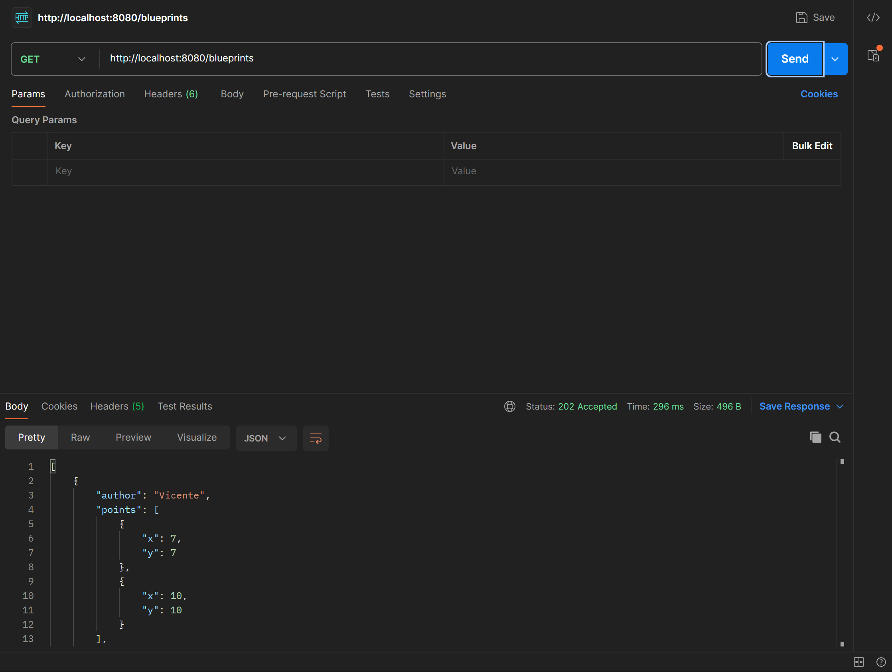
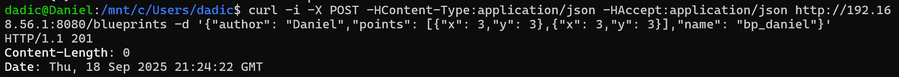
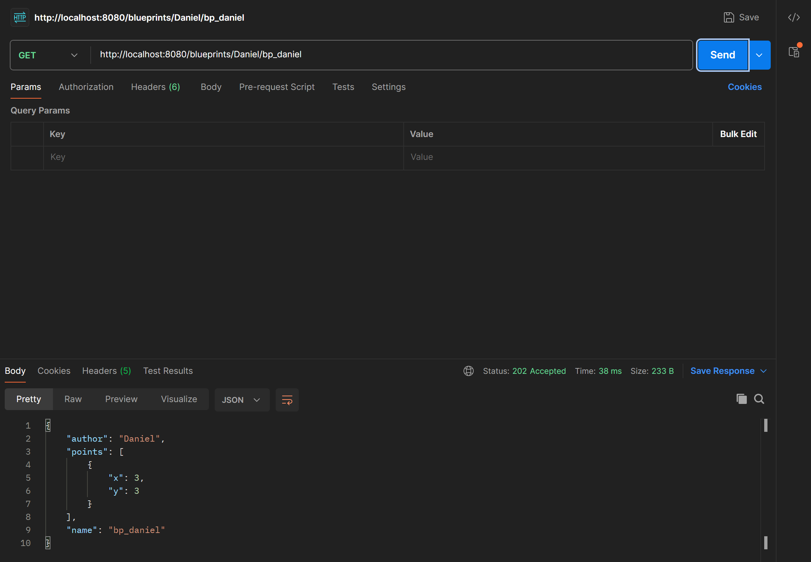

# 🧵 Laboratorio 5 - API REST para la gestión de planos.

**Escuela Colombiana de Ingeniería Julio Garavito**  
**Curso:** Arquitectura de Software (ARSW)

---

## 👥 Integrantes del grupo

- Vicente Garzón Ríos
- Daniel Alejandro Díaz Camelo

---

## 📌 Descripción

xx

--- 

## 📂 Parte I
- Se integraron los Beans del ejercicio anterior (laboratorio 4).
- Se respetaron las anotaciones:
    - `@Service` para los servicios.
    - **En lugar de usar `@Autowired`, se utilizó `@AllArgsConstructor` (Lombok) para inyección de dependencias por constructor**, lo que permite mantener los campos `final` y una inyección más limpia y explícita.

### ⚙️ Controller
Todos los endpoints del controlador están definidos bajo la ruta base `/blueprints`. El controlador incluye los siguientes endpoints:
- **GET /blueprints**: devuelve todos los planos.  
```java
@GetMapping
public ResponseEntity<?> getBlueprints() {
  try {
    return new ResponseEntity<>(blueprintsServices.getAllBlueprints(), HttpStatus.ACCEPTED);
  } catch (Exception e) {
    Logger.getLogger(BlueprintAPIController.class.getName()).log(Level.SEVERE, null, e);
    return new ResponseEntity<>(e.getMessage(), HttpStatus.NOT_FOUND);
  }
}
```
- **GET /blueprints/{author}**: devuelve todos los planos del autor especificado.
```java
@GetMapping("/{author}")
public ResponseEntity<?> getBlueprintsByAuthor(@PathVariable String author) {
  try {
    return new ResponseEntity<>(
            blueprintsServices.getBlueprintsByAuthor(author), HttpStatus.ACCEPTED);
  } catch (BlueprintNotFoundException e) {
    Logger.getLogger(BlueprintAPIController.class.getName()).log(Level.SEVERE, null, e);
    return new ResponseEntity<>(e.getMessage(), HttpStatus.NOT_FOUND);
  }
}
```
- **GET /blueprints/{author}/{bpname}**: devuelve un plano específico, dado el autor y el nombre del plano.
```java
@GetMapping("/{author}/{bpname}")
public ResponseEntity<?> getBlueprintsByAuthorAndBPName(
        @PathVariable String author, @PathVariable String bpname) {
  try {
    return new ResponseEntity<>(
            blueprintsServices.getBlueprint(author, bpname), HttpStatus.ACCEPTED);
  } catch (BlueprintNotFoundException e) {
    Logger.getLogger(BlueprintAPIController.class.getName()).log(Level.SEVERE, null, e);
    return new ResponseEntity<>(e.getMessage(), HttpStatus.NOT_FOUND);
  }
}
```
Todos los endpoints devuelven los planos en **formato JSON**, aplicando el filtrado de puntos correspondiente según la lógica de `BlueprintServices`. Los códigos HTTP se manejan de forma consistente: **202** para operaciones exitosas y **404** cuando el recurso solicitado no existe.

### ✅ Prueba
Para probar los endpoints, hacemos uso de **postman**.

📷 _Evidencia (postman)_

<p align="center">
  
</p>

--- 

## 📂 Parte II
### ⚙️ Controller
- **POST /blueprints**: permite crear un nuevo blueprint enviando un objeto JSON en el cuerpo de la petición.
```java
@PostMapping
public ResponseEntity<?> createBlueprint(@RequestBody Blueprint blueprint) {
  try {
    blueprintsServices.addNewBlueprint(blueprint);
    return new ResponseEntity<>(HttpStatus.CREATED);
  } catch (BlueprintPersistenceException e) {
    Logger.getLogger(BlueprintAPIController.class.getName()).log(Level.SEVERE, null, e);
    return new ResponseEntity<>(e.getMessage(), HttpStatus.FORBIDDEN);
  }
}
```
- **PUT /blueprints/{author}/{bpname}**: permite actualizar un blueprint existente, especificando el autor y el nombre del plano en la URL y enviando la nueva lista de puntos en formato JSON en el cuerpo de la petición.  
```java
@PutMapping("/{author}/{bpname}")
public ResponseEntity<?> updateBlueprint(
        @PathVariable String author, @PathVariable String bpname, @RequestBody List<Point> points) {
  try {
    blueprintsServices.updateBlueprint(author, bpname, points);
    return new ResponseEntity<>(HttpStatus.ACCEPTED);
  } catch (BlueprintNotFoundException e) {
    Logger.getLogger(BlueprintAPIController.class.getName()).log(Level.SEVERE, null, e);
    return new ResponseEntity<>(e.getMessage(), HttpStatus.FORBIDDEN);
  }
}
```
### ✅ Prueba
Para probar que el recurso `‘planos’` acepta e interpreta correctamente las peticiones POST, se usó el comando **curl** de Unix.

📷 _Evidencia (comando curl)_

<p align="center">
  
</p>

Posteriormente, por medio de **postman** verificamos que se haya creado de manera exitora mediante un metodo **GET**.

📷 _Evidencia (postman)_

<p align="center">
  
</p>

## 📂 Parte III
La explicación se encuentra en el siguiente archivo 
[ANALISIS_CONCURRENCIA.txt](ANALISIS_CONCURRENCIA.txt)
